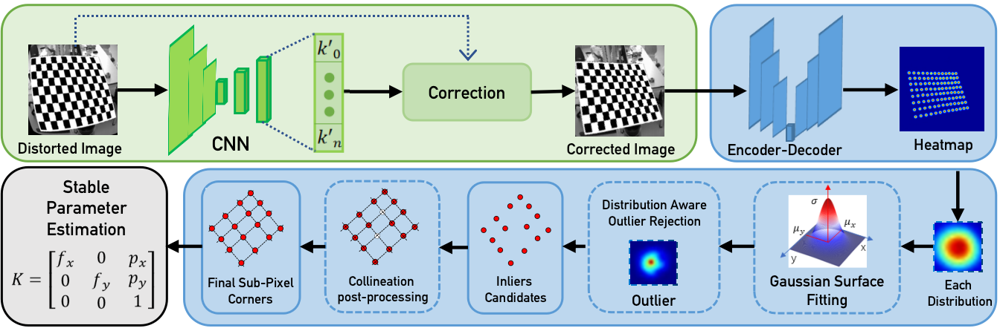
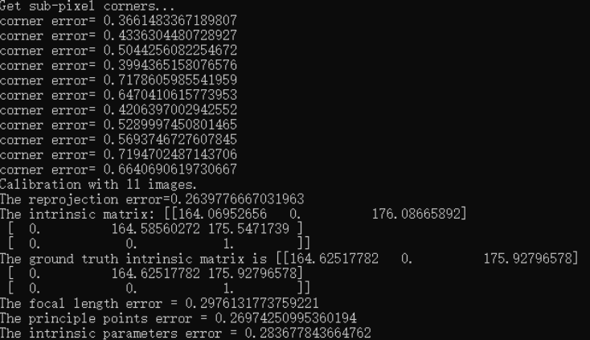

# Learning-based Camera Calibration
---
This is the official implementation of the paper: `Learning-based Distortion Correction and Feature Detection for High Precision and Robust Camera Calibration', by Yesheng Zhang and Xu Zhao and Dahong Qian.

## Abstract
---
We propose a learning-based Camera Calibration System (CCS).
In this framework, the accuracy and robustness of camera calibration are improved from three aspects: distortion correction, corner detection and parameter estimation.
Specifically, the distortion correction is performed by the learning-based method.
Accurate feature locations are achieved by the combination of learning-based detection, specially designed refinement and complete post-processing.
Moreover, we obtain stable parameter estimation by a RANSAC-based procedure.



## Paper  
---

Our paper is accepted by RA-L & IROS22.
The pdf file can be found [here](https://ieeexplore.ieee.org/document/9834080).

### BibTex
```Latex
@ARTICLE{9834080,  
author={Zhang, Yesheng and Zhao, Xu and Qian, Dahong},  
journal={IEEE Robotics and Automation Letters},   
title={Learning-Based Distortion Correction and Feature Detection for High Precision and Robust Camera Calibration},   
year={2022},  
volume={7},  
number={4},  
pages={10470-10477},  
doi={10.1109/LRA.2022.3192610}}
```


## Update log
---
- 22-05-18: Code Release.

## TODO LIST
---

- [x] code released.
- [x] README completed.
- [x] Detection weights released.

## Usage
---

### Requirements
- CUDA ~= 9.2
- python ~= 3.6
- pytorch ~= 1.2.0
- torchvision ~= 0.4.0
- python-opencv ~= 3.4.2
- Numpy ~= 1.16

They can all be installed following command:
``` shell
    conda create -n CCF python=3.6
    pip install -r requirements.txt
    conda activate CCF
```


### File Folder Configuration  


we use the fixed data folder structure for calibration input and output as follows:

``` shell
data
├── DetectRes # [output] for detection
│   ├── color_img # [output] colored heatmap
│   └── heatmap # [output] heatmap
├── GT # [input and optional] for evaluation
├── SubpixelRes # [output] sub-pixel refinement
├── dist_img # [input] original images
└── img # [output or input] corrected images (output) or images without distortion (input)
```

See Examples in `./demo_data/*`.


### Demo data

We provide three sets of calibration data for demo in `./demo_data/`.

For simplicity, we directly provide our distortion correction and detection results here.

You can train your own networks for these results using our training scripts as well.

The images provided here are screened out from a larger image set by our RANSAC-based calibration procedure, for the sake of convenience。

### Run 
First, you need to modify the data path in `./Demo_calib.py `, and you can choose one of the three data sets we provided in `./demo_data/`.

Then the demo calibration can be run following commands:
```python
    python Demo_calib.py
```

The results can be seen like:




### Training

**Note:** Before the training, you need to prepare the dataset following the **Data Generation** part and modify the corresponding parameters in `settings/settings.py`.

We also provide training scripts for our corner detection network and distortion correction network.

*Corner Detection:* You can use the `train_CornerDetect.py`, the parameters are as follows:

```python
    python train_CornerDetect.py \
        -e [epoch] \
        -b [batchsize] \
        -l [learning rate]
```

*Distortion Correction:* You can use the `train_DistCorr.py`, the parameters are as follows:

```python
    python train_DistCorr.py \
        -e [epoch] \
        -b [batchsize] \
        -l [learning rate] \
        -o [parameter order]
```

### Data Generation
You can run `data_generator.py` to generate synthetic dataset with chessboard images and camera parameters.

See `dataset/README.md` for details.
