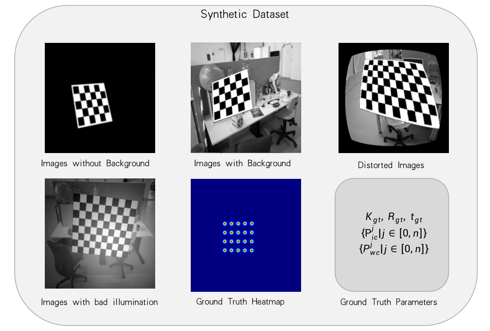
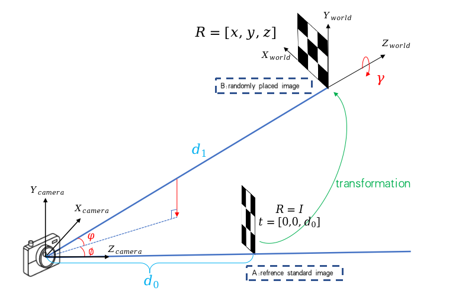

<!--
 * @Author: EasonZhang
 * @Date: 2022-05-11 15:19:46
 * @LastEditors: EasonZhang
 * @LastEditTime: 2022-05-12 15:43:08
 * @FilePath: /Code_github/dataset/README.md
 * @Description: Data Generation Manual
 * 
 * Copyright (c) 2022 by EasonZhang, All Rights Reserved. 
-->

# Data Generation
---
Here we provide the code for our synthetic data generation, including chessboard images, ground truth camera parameters and so on.

If you find this code useful, please cite:
```Latex
@ARTICLE{9834080,  
author={Zhang, Yesheng and Zhao, Xu and Qian, Dahong},  
journal={IEEE Robotics and Automation Letters},   
title={Learning-Based Distortion Correction and Feature Detection for High Precision and Robust Camera Calibration},   
year={2022},  
volume={7},  
number={4},  
pages={10470-10477},  
doi={10.1109/LRA.2022.3192610}}
```



## Chessboard images generation with camera parameters
---


### Extrinsic parameter representation
We use two angles: $\phi, \theta$ and a distance: $d$ to represent the chessboard translation related to camera, which can be seen in the figure above, instead of traditional $t$.
The rotation is represented by three euler angles: $[x,y,z]$.

### Draw randomly placed chessboard image from a standard image
As the refrence standard image can be easily projected from 3D to 2D, we use the standard image to generate the other ones.

The relationship between these two kind of images can be derived as follows:

The reference image is projected by: $P_{ic}^0 = K[I | t^0]P_{wc}$

The randomly placed image is projected by: $P_{ic}^1 = K[R^1 | t^1]P_{wc}$

where $ic$ represents the image coordinate system, and $wc$ is the world coordinate system.

Thus, the image trasformation is: $P_{ic}^1 = KR^1K^{-1}P_{ic}^0 - KR^1t^0 + Kt^1$

Based on this equation, we can get the $P_{ic}^1$, which is the image of randomly placed chessboard.

## Data Augmentation
---
We apply various data augmentations in our data as follows:
- Guassian Noise
- Radial Distortion
- Uneven Illumination
- Backgroud of indoor scene from [TUM RGBD Dataset](https://vision.in.tum.de/data/datasets/rgbd-dataset/download) (mostly fr3 sequence).

The details can be seen in our paper.

## For chessboard corner detection
---
To train this network, you need to generate chessboard images along with ground truth heatmap.

## For distortion correction
---
To train the distortion correction network, you need to generate distorted images and ground truth grid points after distortion.

## Usage
In `../data_generator.py`, you can see the chessboard image configuration like:
```python
dataset_gene_config = {
    'pathname': 'template', # name
    'pose numbers' : 2, # equals to image number in an calibration set
    'fx': [120, 180], # focal length: 120~180 (upper and lower limits)
    'fy': [120, 180], 
    'px': [150, 180], # principle points: 150~180
    'py': [150, 180],
    'checkboard size' : [(5,5), (5,6), (6,6), (7,8)], # a list of sizes
    'd': [3,6], # distance d_1
    'theta': [-35, 35], # translation angle
    'phi': [-35, 35], # tanslation angle
    'x': [-50, 50], # euler angles
    'y': [-50, 50], # euler angles
    'z': [0, 120], # euler angles
    'max item': 400 # number of calibration set  
}
```
The synthetic data will be saved in `DATASETPATH/pathname`, the `DATASETPATH` can be modified in `../settings/settings.py`.

After you modified these configurations, you can run the following command to generate data:
```python
    python data_generator.py 
```
